# USS Tremor - Game Level For Unvanquished
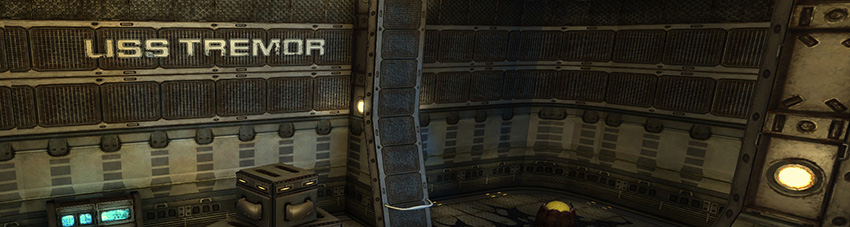 

## Overview:

USS Tremor is a game level by Matthias "Masmblr" Peters for the open source game [_Unvanquished_](https://Unvanquished.net/).

##  Description: 
USS Tremor is an evolution of the Tremulous map-remake  "Tremor 2016" for the open-source game Unvanquished.

Excerpt from the old readme:
> For a long time, Tremor held a special place as one of my favorite maps. However, its rushed appearance always bothered me. Determined to do justice to Tremor, I embarked on a mission to reshape it.
> Introducing Tremor 2016, a homage to Vedacon's original map "Tremor". This remake involved a complete redesign while preserving the beloved layout, recreating the map from the ground up.
> A notable addition is the cargo elevator within the storage area. Hint brushes were used for optimal performance and space-themed immersion. An extensive sound atmosphere adds to the immersive experience.
> This is an UNOFFICIAL remake, a labor of love aiming to pay tribute to Tremor's legacy and provide players with an unforgettable gaming experience :).

* * *
Improvements for version 1.1:

    -The machinery section has been lined with player-clip brushes to prevent players from falling through the structure (glitching).
    -The lighting has been completely overhauled. Some areas now feature detailed shadow casting compared to before.
    -Extensive use of D-Lights (via particle system) has been made to enhance the atmosphere.
    -There are several new textures, models, and particle effects.
    -The entire map has received a new sound backdrop.
    -"Sound-Traps" have been added, playing a sound when passed and only triggerable again after a set interval.
    -The VIS portals have been simplified.
    -Some outdoor areas have been added to enhance the spaceship feel.
    -Some minor changes to entities.
    -Brushwork has been altered in certain areas.
 * * *
 
## Screenshots:
[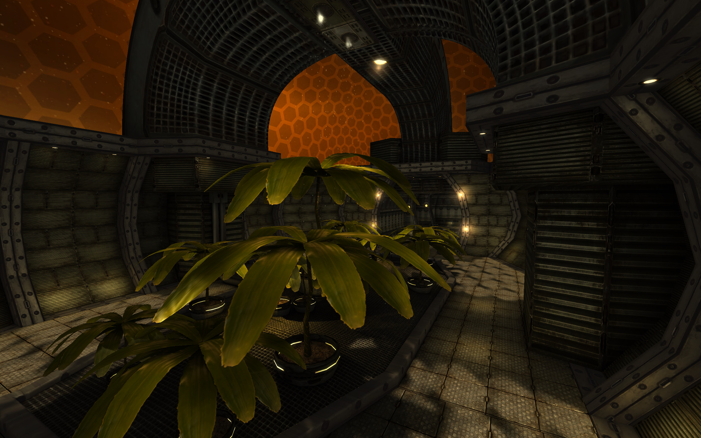](readme_meta/preview_levelshots/1.jpg)
[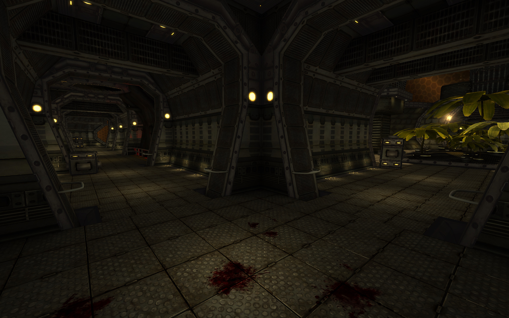](readme_meta/preview_levelshots/2.jpg)
[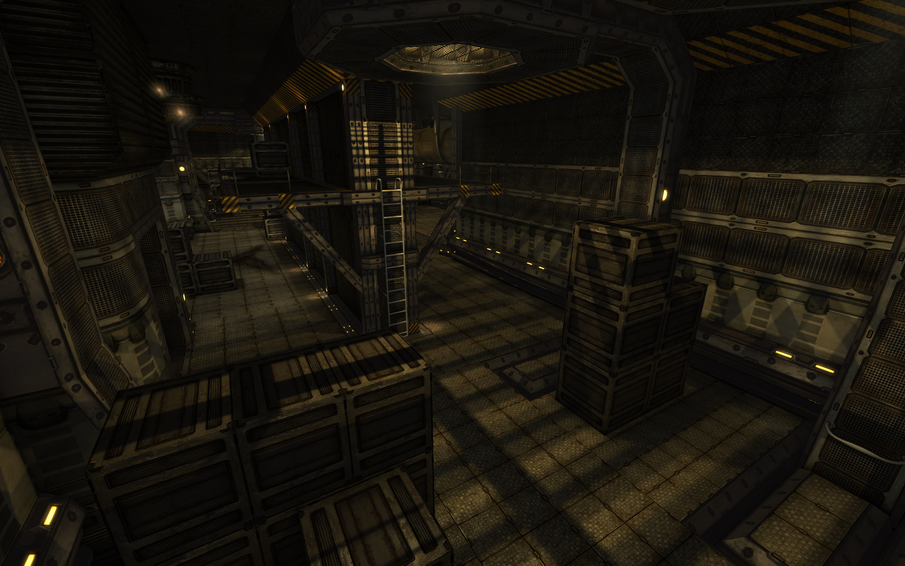](readme_meta/preview_levelshots/3.jpg)
[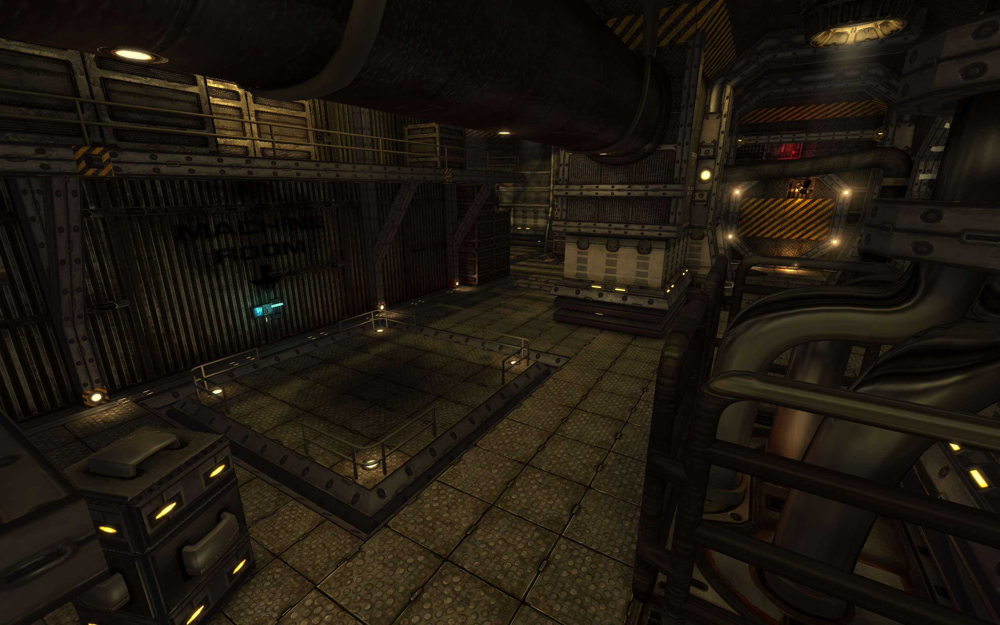](readme_meta/preview_levelshots/4.jpg)
[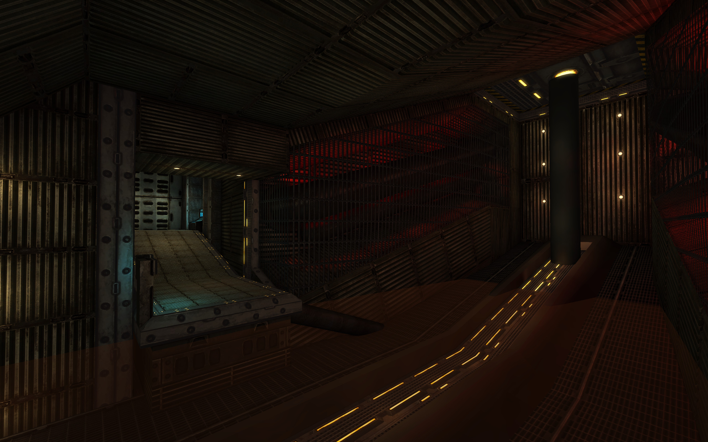](readme_meta/preview_levelshots/5.jpg)
[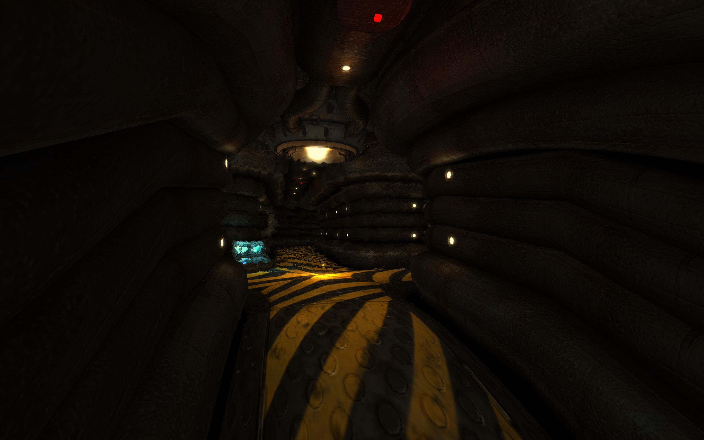](readme_meta/preview_levelshots/6.jpg)
[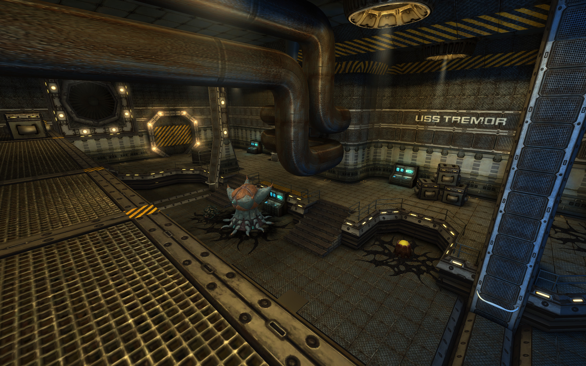](readme_meta/preview_levelshots/7.jpg)
[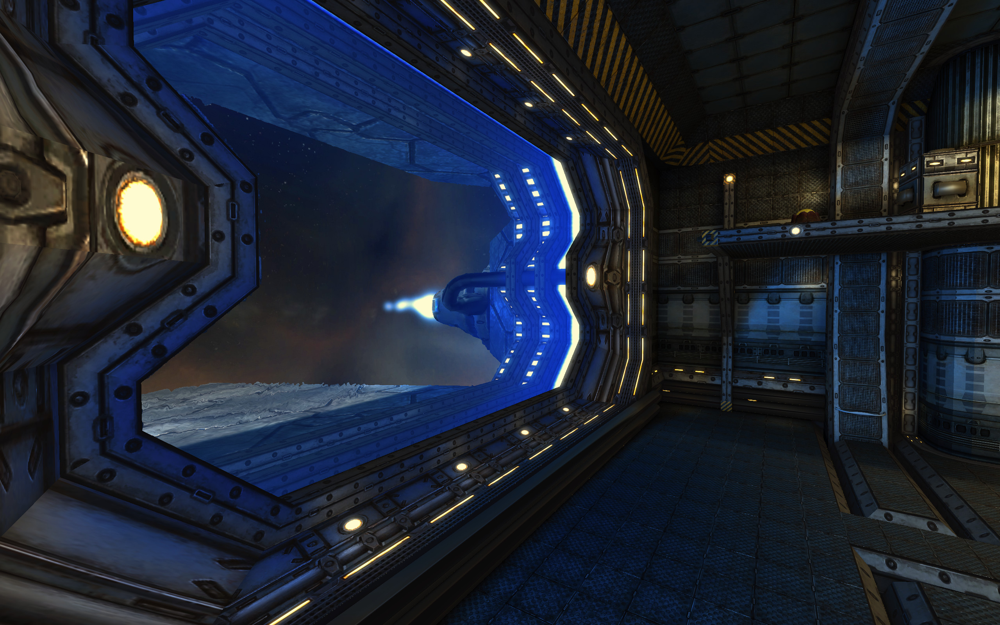](readme_meta/preview_levelshots/8.jpg)
[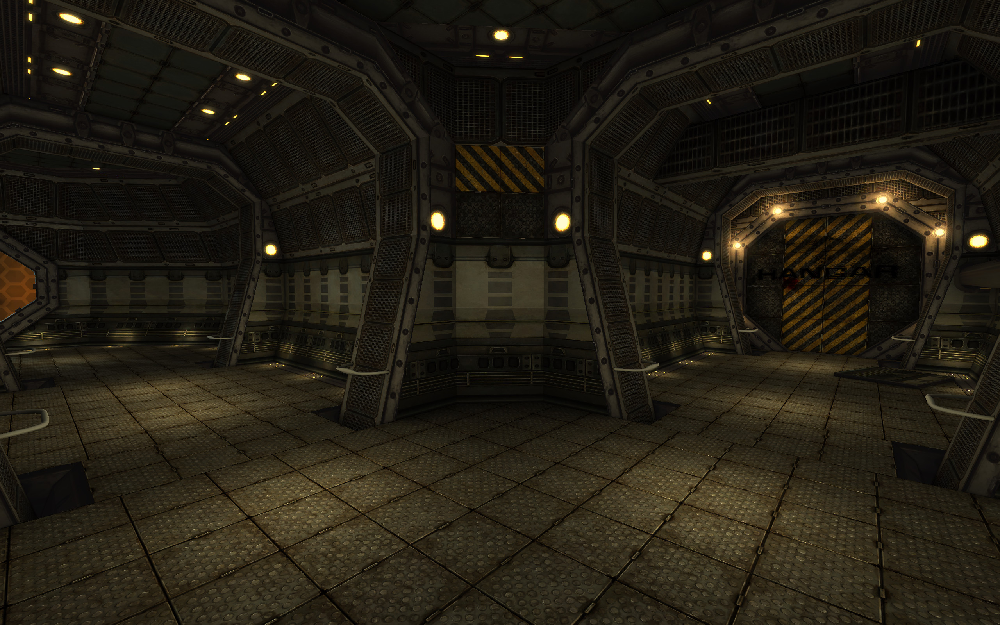](readme_meta/preview_levelshots/9.jpg)
[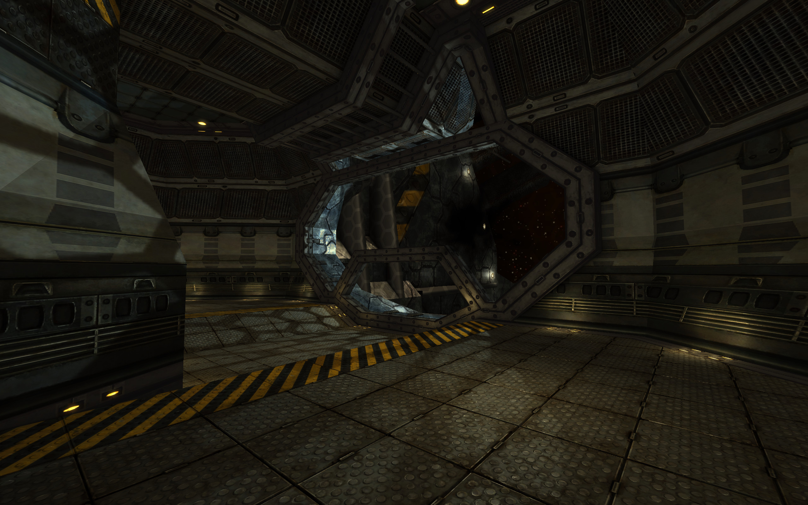](readme_meta/preview_levelshots/10.jpg)
[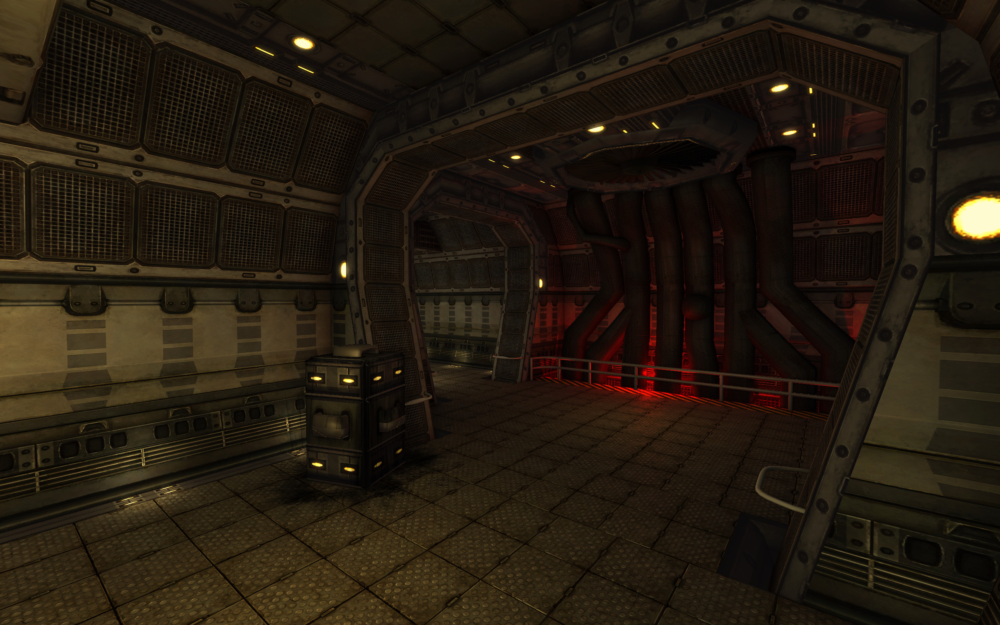](readme_meta/preview_levelshots/11.jpg)
[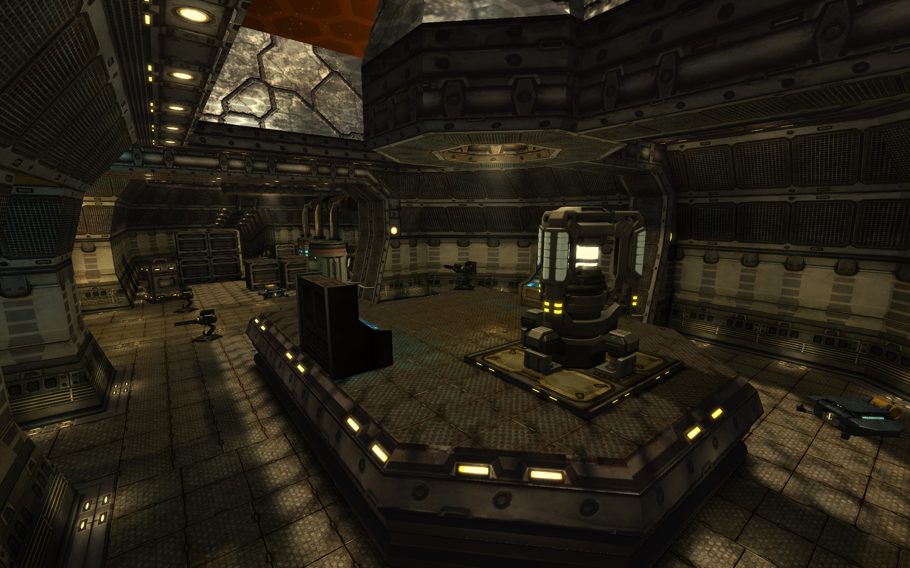](readme_meta/preview_levelshots/12.jpg)

## History:
| Version: | Date:        | Status: | Release Build (.dpk):       
| ------- | ------------- | ------: | -----------------: |
| 1.0    | 07/02/2018  | beta | :x:        |     
| 1.1    | 04/04/2024  | beta | [💾](https://github.com/Masmblr/map-usstremor_src/releases/) |

## Development Tools:
[GIMP](https://www.gimp.org/) \
[Audacity](https://www.audacityteam.org/) \
[NetRadiant](https://netradiant.gitlab.io/) \
[Q3Map2](http://q3map2.robotrenegade.com/)

## Thanks to:
* id Software for Quake3
* Team Xonotic for NetRadiant 
* Unvanquished Development for Unvanquished

## Related Resources:
Unvanquished website: https://unvanquished.net  
NetRadiant Level-Editor: https://netradiant.gitlab.io  

## Credits - Legal Information and Attribution
Some assets may be derivative works or subject to different licenses. 
Please refer for author and license details. Note that some files may have been modified. 
Below is a list of files and their legal statuses. For license information, refer to the LICENSE file.
Modified files or derivatives are marked with an asterisk (*).

>Format: [AUTHOR], [LICENSE], Files = [FILELIST]

**Matthias “Masmblr” Peters** (masmblr@gmail.com),  CC BY 4.0 Deed - Attribution 4.0 International , Files =
- DEPS 
- README.md 
- readme_vordruck.txt 
- about\usstremor.txt 
- maps\usstremor-builder.navMesh 
- maps\usstremor-human_bsuit.navMesh 
- maps\usstremor-human_naked.navMesh 
- maps\usstremor-level0.navMesh 
- maps\usstremor-level1.navMesh 
- maps\usstremor-level1upg.navMesh 
- maps\usstremor-level2.navMesh 
- maps\usstremor-level2upg.navMesh 
- maps\usstremor-level3.navMesh 
- maps\usstremor-level3upg.navMesh 
- maps\usstremor-level4.navMesh 
- maps\usstremor.bsp + .map
- maps\usstremor\lm_0000.webp
- maps\usstremor\lm_0001.webp
- maps\usstremor\lm_0002.webp
- maps\usstremor\lm_0003.webp
- maps\usstremor\lm_0004.webp
- maps\usstremor\lm_0005.webp
- maps\usstremor\lm_0006.webp
- maps\usstremor\lm_0007.webp
- maps\usstremor\lm_0008.webp
- maps\usstremor\lm_0009.webp
- maps\usstremor\lm_0010.webp
- maps\usstremor\lm_0011.webp
- maps\usstremor\lm_0012.webp
- maps\usstremor\lm_0013.webp
- maps\usstremor\lm_0014.webp
- maps\usstremor\lm_0015.webp
- readme_meta\usstremor\usstremor.arena 
- readme_meta\usstremor\usstremor.webp
- minimaps\usstremor.minimap 
- minimaps\usstremor.webp
- models\usstremor\box.ase 
- models\usstremor\box2.ase 
- models\usstremor\comp_01.ase 
- models\usstremor\comp_02.ase 
- models\usstremor\scenery_outdoor_area_01.ase 
- models\usstremor\turbine.ase 
- models\usstremor\turbine_blades.ase 
- scripts\shaderlist.txt 
- scripts\usstremor.particle 
- scripts\usstremor_custom.shader 
- textures\usstremor_custom_src\black_01.webp
- textures\usstremor_custom_src\box_01_d.webp
- textures\usstremor_custom_src\box_01_h.webp
- textures\usstremor_custom_src\box_01_n.webp
- textures\usstremor_custom_src\box_01_s.webp
- textures\usstremor_custom_src\decal_01.webp
- textures\usstremor_custom_src\decal_02.webp
- textures\usstremor_custom_src\decal_03.webp
- textures\usstremor_custom_src\decal_04.webp
- textures\usstremor_custom_src\decal_05.webp
- textures\usstremor_custom_src\decal_06.webp
- textures\usstremor_custom_src\decal_07.webp
- textures\usstremor_custom_src\decal_08.webp
- textures\usstremor_custom_src\decal_09.webp
- textures\usstremor_custom_src\decal_10.webp
- textures\usstremor_custom_src\decal_10_b.webp
- textures\usstremor_custom_src\decal_11.webp
- textures\usstremor_custom_src\decal_12.webp
- textures\usstremor_custom_src\decal_13.webp
- textures\usstremor_custom_src\distortion.webp
- textures\usstremor_custom_src\env_01.webp
- textures\usstremor_custom_src\env_01_seamless.webp
- textures\usstremor_custom_src\env_02.webp
- textures\usstremor_custom_src\flare.webp
- textures\usstremor_custom_src\fog.webp
- textures\usstremor_custom_src\forcefield_01.webp
- textures\usstremor_custom_src\glass_01.webp
- textures\usstremor_custom_src\readme_metal_02.webp
- textures\usstremor_custom_src\readme_metal_02_n.webp
- textures\usstremor_custom_src\readme_metal_02_s.webp
- textures\usstremor_custom_src\readme_metal_03.webp
- textures\usstremor_custom_src\readme_metal_03_n.webp
- textures\usstremor_custom_src\readme_metal_03_s.webp
- textures\usstremor_custom_src\readme_metal_04.webp
- textures\usstremor_custom_src\readme_metal_04_n.webp
- textures\usstremor_custom_src\readme_metal_04_s.webp
- textures\usstremor_custom_src\readme_metal_05.webp
- textures\usstremor_custom_src\readme_metal_05_n.webp
- textures\usstremor_custom_src\readme_metal_05_s.webp
- textures\usstremor_custom_src\redshade_01.webp
- textures\usstremor_custom_src\sfx_sprite_01.webp
- textures\usstremor_custom_src\sfx_sprite_02.webp
- textures\usstremor_custom_src\sign_01.webp
- textures\usstremor_custom_src\smoke_01.webp
- textures\usstremor_custom_src\sparks_01.webp
- textures\usstremor_custom_src\sparks_02.webp
- textures\usstremor_custom_src\water_splash.webp

**Philip Klevestav** (https://www.philipk.net), Creative Commons Attribution 3.0 Unported License, Files =
- textures\usstremor_custom_src\light_01_d.webp *
- textures\usstremor_custom_src\light_01_g.webp *
- textures\usstremor_custom_src\light_01_n.webp *
- textures\usstremor_custom_src\light_01_s.webp *
- textures\usstremor_custom_src\readme_metal_00_blue.webp *
- textures\usstremor_custom_src\readme_metal_00_blue_g.webp *
- textures\usstremor_custom_src\readme_metal_01.webp *

**Stijn “Ingar” Buys** (http://ingar.satgnu.net),  Attribution License, Files =
- models\usstremor\dirt.webp *
- models\usstremor\dirt_n.webp *
- models\usstremor\dirt_s.webp *
- models\usstremor\leaf1.webp *
- models\usstremor\leaf1_n.webp *
- models\usstremor\leaf1_s.webp *
- models\usstremor\leaf2.webp *
- models\usstremor\leaf2_n.webp *
- models\usstremor\leaf2_s.webp *
- models\usstremor\plant1.ase  *
- models\usstremor\plant2.ase  *
- models\usstremor\pot.webp *
- models\usstremor\pot_g.webp *
- models\usstremor\pot_n.webp *
- models\usstremor\pot_s.webp *
- models\usstremor\root.webp *
- models\usstremor\root_n.webp *
- models\usstremor\root_s.webp *
- models\usstremor\trunk.webp *
- models\usstremor\trunk_n.webp *
- models\usstremor\trunk_s.webp *

**newlocknew** (https://freesound.org/people/newlocknew/), Attribution 4.0, Files =
- sounds\usstremor\button.opus *
- sounds\usstremor\computer_sounds.opus *
- sounds\usstremor\electric_sparks.opus *
- sounds\usstremor\engine_blast.opus *
- sounds\usstremor\fan_big.opus *
- sounds\usstremor\force_field.opus *
- sounds\usstremor\levelwide_rumble.opus *
- sounds\usstremor\lift.opus *
- sounds\usstremor\machine_power_spot.opus *
- sounds\usstremor\machine_sound_high.opus *
- sounds\usstremor\machine_sound_low.opus *
- sounds\usstremor\machine_with_pipe.opus *
- sounds\usstremor\pipe_steam.opus *
- sounds\usstremor\sound_trap_01.opus *
- sounds\usstremor\sound_trap_02.opus *
- sounds\usstremor\sound_trap_03.opus *
- sounds\usstremor\sound_trap_04.opus *
- sounds\usstremor\sound_trap_05.opus *
- sounds\usstremor\sound_trap_06.opus *
- sounds\usstremor\sound_trap_07.opus *
- sounds\usstremor\sound_trap_08.opus *
- sounds\usstremor\watering.opus *
- sounds\usstremor\window_rumble.opus *

**Unvanquished-Development** (https://www.unvanquished.net), GNU GPLv3, CC BY-SA 2.5, Files =
- gfx\usstremor\colorgrading.webp *

**Allen R. Walden** (https://www.fontspace.com/allen-r-walden), Freeware / Non-Commercial
- final-frontier-shipside-font (used in several textures) *
